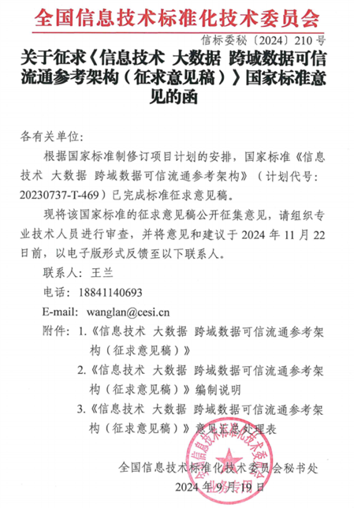

全国信息技术标准化技术委员会秘书处发布了“关于征求《信息技术 大数据 跨域数据可信流通参考架构（征求意见稿）》国家标准意见的函”，标志着我实验室牵头的国家标准正式进入公开征求意见阶段。

<!--more-->

工作简介

近日，全国信息技术标准化技术委员会秘书处发布了“关于征求《信息技术 大数据 跨域数据可信流通参考架构（征求意见稿）》国家标准意见的函”，标志着该标准正式进入公开征求意见阶段。《信息技术 大数据 跨域数据可信流通参考架构》国家标准是由杜小勇教授牵头的“面向城市智能服务的数据治理体系与共享平台”国家重点研发计划的重要成果之一，由中国人民大学、清华大学、北京大学、中国电子技术标准化研究院、京东城市（北京）数字科技有限公司等单位共同起草。

《信息技术 大数据 跨域数据可信流通参考架构》标准针对数据价值释放与安全隐私保护之间的矛盾，构建了一套跨域数据可信共享参考架构，为跨域数据可信共享提供标准，保障数据跨部门、跨行业、跨区域的有序可信高效流动。该标准草案提供了一个跨域数据流通的参考架构模型，涵盖了数据持有方、使用方和中介方的功能要求。架构从数据发布、查询到使用、溯源和审计，定义了跨域服务、数据对齐、数据管控等核心流程，确保数据在跨域流通中的安全性和可信性。标准采用了跨域计算、可信溯源、身份标识和权限管控等技术，保证数据在流通过程中的隐私保护和合法使用。此次标准草案已经进入征求意见稿阶段，计划在2024年11月22日前广泛收集意见。通过此次征求意见，进一步完善和优化标准内容，使其具备更强的实际适用性和可操作性。

